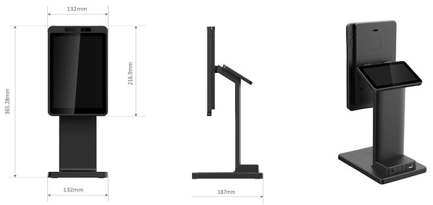

# Android Multiple screens sample

## Overview
This is a sample of demonstrating how to display contents on the second screen with Android Activities on the device like [PayPadPlus](https://www.japancv.co.jp/en/solutions/fr_payment/).

## [Multi-display](https://developer.android.com/guide/topics/large-screens/multi-window-support)
Android 10 (API level 29) supports activities on secondary displays. If an activity is running on a device with multiple displays, users can move the activity from one display to another. Multi-resume applies to multi-screen scenarios as well; several activities can receive user input at the same time.

## PayPadPlus

## License
[MIT](https://choosealicense.com/licenses/mit/)